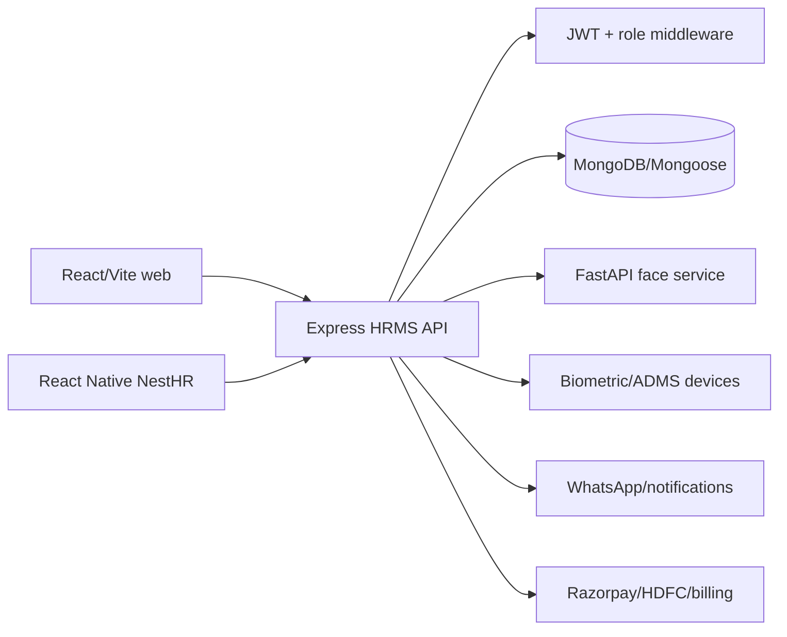
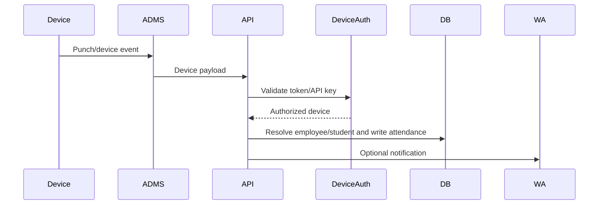

# NestHR Architecture

**Last reviewed:** 2026-09-20

## System Design

## Components

- `backend/server.js`: CORS, Helmet, timeout, logging, JSON body limits, uploads, rate limits, route registration, health endpoint.
- `backend/routes/`: domain endpoints for auth, employees, attendance, payroll, leave, biometric, reports, documents, billing, support, and more.
- `backend/controllers/`: business operations and response handling.
- `backend/models/`: tenant, user, employee, attendance, payroll, leave, document, device, billing, and audit schemas.
- `backend/middleware/`: auth/authorization, uploads, validation, and error behavior.
- `backend/jobs/`: recurring attendance/notification work.
- `frontend/src/`: role-aware web pages, API service, contexts, design system, reports, and exports.
- `NestHR/src/`: mobile API, auth context, navigation, screens, theme, and biometric/attendance UX.
- `face-service/main.py`: internal FastAPI service producing/verifying 128-value face embeddings.

## Data Flow: Face Attendance

1. Mobile captures a front-camera image and location.
2. Backend checks the authenticated employee and attendance policy.
3. Backend sends the image to the internal face service with its shared API key.
4. Face service decodes/resizes the image, requires exactly one face, and returns an embedding or match result.
5. Backend validates location/threshold/policy, writes attendance, and triggers configured notifications.

## Data Flow: Device Attendance

ADMS and device-facing routes must be treated as hostile network boundaries and authenticated independently of browser JWTs.

## Domain Route Groups

`/api/auth`, `/api/company`, `/api/dashboard`, `/api/employees`, `/api/attendance`, `/api/leaves`, `/api/payroll`, `/api/recruitment`, `/api/departments`, `/api/performance`, `/api/settings`, `/api/billing`, `/api/payment-methods`, `/api/biometric`, `/api/holidays`, `/api/payroll-config`, `/api/attendance-settings`, `/api/late-approvals`, `/api/loans`, `/api/shifts`, `/api/salary-heads`, `/api/designations`, `/api/offer-letters`, `/api/transactions`, `/api/push`, `/api/exit`, `/api/audit`, `/api/admin`, `/api/crm`, `/api/support`, `/api/documents`, `/api/announcements`, `/api/tasks`, `/api/assets`, `/api/attendance-corrections`, and `/api/trash`.

## Configuration

- Backend values live in `backend/.env`.
- Web API URL is supplied through Vite environment configuration.
- Mobile currently has a production API base in `NestHR/src/config/env.ts` with a commented local option.
- Face service uses `FACE_SERVICE_URL`, `FACE_SERVICE_API_KEY`, threshold, and image-dimension settings.
- Never record secret values in this document.

## Architectural Invariants

- Every company-owned query must use the authenticated company scope.
- Authorization is enforced on the server; navigation merely mirrors capabilities.
- Biometric templates and documents require stronger handling than ordinary profile fields.
- Payroll and billing mutations must be auditable and idempotent where external payment callbacks are involved.
- Date-only attendance uses UTC-normalized calendar dates; timestamps are preserved separately.
